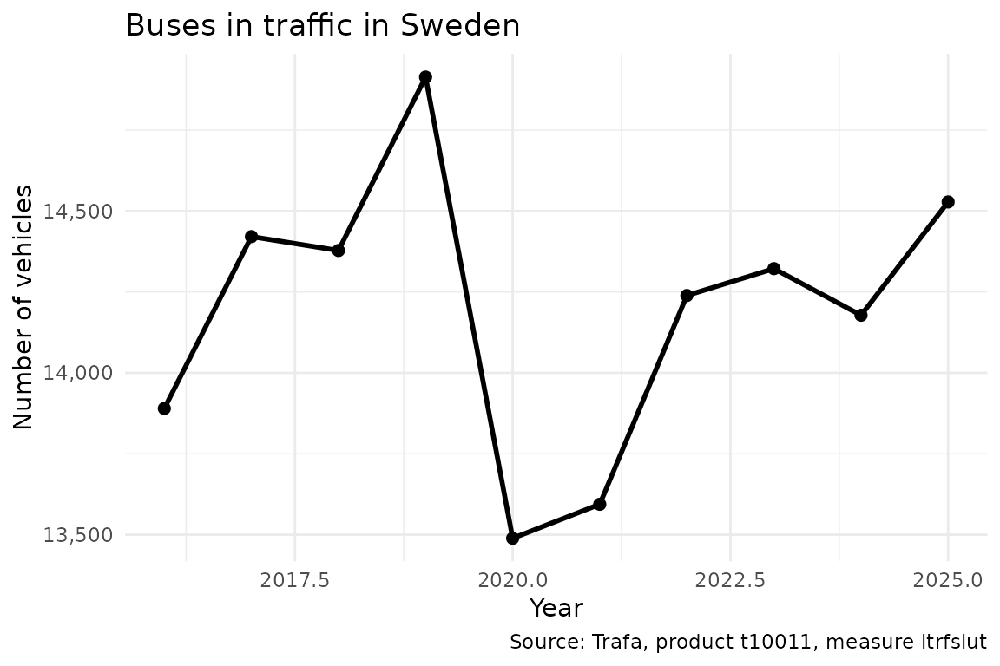

# A quick start guide to rTrafa

This vignette provides a quick start guide to get up and running with
rTrafa as fast as possible. For a more comprehensive introduction, see
[Introduction to
rTrafa](https://lchansson.github.io/rTrafa/articles/introduction-to-rtrafa.md).

``` r
install.packages("rTrafa")
```

``` r
library("rTrafa")
```

In this guide we walk you through five steps to discover products,
explore their structure, download data and visualise it.

Trafa’s data is organised in three layers: **Product** (a statistical
domain, e.g. “Buses”), **Measure** (what is measured, e.g. “Vehicles in
traffic”), and **Dimension** (how to filter, e.g. year, fuel type). To
download data you specify a product, a measure, and optionally dimension
filters.

### 1. Get products

Trafa publishes dozens of statistical products. Start by listing them:

``` r
products <- get_products()
```

``` r
dplyr::glimpse(products)
#> Rows: 56
#> Columns: 5
#> $ name        <chr> "t10011", "t10014", "t10015", "t10017", "t10018", "t10019"…
#> $ label       <chr> "Bussar", "Motorcyklar", "Mopeder klass I", "Släpvagnar", …
#> $ description <chr> "", "", "", "", "", "", "", "", "Bussar\n\nDefinitioner-> …
#> $ id          <int> 203, 206, 207, 209, 210, 211, 222, 227, 231, 232, 233, 234…
#> $ active_from <chr> "2019-01-10T10:17:00", "2019-01-10T10:25:00", "2019-01-10T…
```

Use
[`product_search()`](https://lchansson.github.io/rTrafa/reference/product_search.md)
to filter by text:

``` r
products |>
  product_search("Bussar") |>
  product_describe(max_n = 3)
#> ── t10011: Bussar ─────────────────────────────────────────────────────────────── 
#>   Active from: 2019-01-10T10:17:00 
#> 
#> ── t10091: Bussar ─────────────────────────────────────────────────────────────── 
#>   Description: Bussar
#> 
#> Definitioner-> Bussklass: För fordon som är inrättade för befordran av fler än 22 passagerare utöver föraren finns följande fordonsklasser: Klass I – Fordon som tillverkats med utrymmen för ståplatspassagerare för att medge frekventa förflyttningar av passagerare. Klass II – Fordon som huvudsakligen tillverkats för befordran av sittplatspassagerare och som är utformade för att medge befordran av ståplatspassagerare i mittgången och/eller i ett utrymme som inte är större än att det utrymme som upptas för två dubbelsäten. Klass III – Fordon som uteslutande tillverkats för befordran av sittplatspassagerare. För fordon som är inrättande för befordran av högst 22 passagerare utöver föraren finns följande fordonsklasser: Klass A – Fordon utformade för befordran av ståplatspassagerare. Ett fordon i denna klass är utrustat med säten och ska ha utrymme för ståplatspassagerare. Klass B – Fordon som inte är utformade för befordran av ståplatspassagerare. Ett fordon i denna klass saknar utrymme för ståplatspassagerare.
#>   Active from: 2019-04-29T11:00:00 
#> 
#> ── t10021: Bussar ─────────────────────────────────────────────────────────────── 
#>   Active from: 2020-05-08T12:59:00
```

### 2. Explore measures

Each product has several measures (KPIs). Let’s see what’s available for
Buses (t10011):

``` r
measures <- get_measures("t10011")
```

``` r
measures |> measure_describe()
#> ── itrfslut (Antal i trafik) ──────────────────────────────────────────────────── 
#>   Product: t10011
#>   Description: Avser i slutet av perioden 
#> 
#> ── avstslut (Antal avställda) ─────────────────────────────────────────────────── 
#>   Product: t10011
#>   Description: Avser i slutet av perioden 
#> 
#> ── nyregunder (Antal nyregistreringar) ────────────────────────────────────────── 
#>   Product: t10011
#>   Description: Avser under perioden 
#> 
#> ── avregunder (Antal avregistreringar) ────────────────────────────────────────── 
#>   Product: t10011
#>   Description: Avser under perioden
```

### 3. Explore dimensions

Dimensions are the variables you can filter on. Use
[`get_dimensions()`](https://lchansson.github.io/rTrafa/reference/get_dimensions.md)
to discover them:

``` r
dims <- get_dimensions("t10011")
```

``` r
dims |> dimension_describe()
#> ── ar (År) ────────────────────────────────────────────────────────────────────── 
#>   Data type: Time
#>   Selectable: Yes 
#>   Values (25): 2001 = 2001, 2002 = 2002, 2003 = 2003, 2004 = 2004, 2005 = 2005 ... and 20 more
#>   Filters: senaste = Senaste, forra = Föregående
#> 
#> ── avregform (Avregistreringsorsak) ───────────────────────────────────────────── 
#>   Selectable: Yes 
#>   Values (2): 20 = Utförda ur landet, t1 = Totalt
#> 
#> ── dimpo (Direkt import) ──────────────────────────────────────────────────────── 
#>   Selectable: Yes 
#>   Values (2): 10 = Direkt import, t1 = Totalt
#> 
#> ── leasing (Leasing) ──────────────────────────────────────────────────────────── 
#>   Selectable: Yes 
#>   Values (2): 30 = Leasade, t1 = Totalt
#> 
#> ── bussklass (Bussklass) ──────────────────────────────────────────────────────── 
#>   Description: Bussklasser enligt föreskrift nr 107 UNECE
#>   Selectable: Yes 
#>   Values (7): 1 = A, 2 = B, 3 = I, 4 = II, 5 = III ... and 2 more
#> 
#> ── drivm (Drivmedel) ──────────────────────────────────────────────────────────── 
#>   Selectable: Yes 
#>   Values (10): 101 = Bensin, 102 = Diesel, 103 = El, 104 = Elhybrid, 105 = Laddhybrid ... and 5 more
#> 
#> ── pass (Antal passagerare) ───────────────────────────────────────────────────── 
#>   Selectable: Yes 
#>   Values (12): 101 = – 20, 102 = 21 – 40, 103 = 41 – 50, 104 = 51 – 60, 105 = 61 – 70 ... and 7 more
#> 
#> ── agarkat (Ägarkategori)  [agare] ────────────────────────────────────────────── 
#>   Selectable: Yes 
#>   Values (3): 10 = Fysisk person, 20 = Juridisk person, t1 = Totalt
#> 
#> ── tillst (Tillstånd)  [agare] ────────────────────────────────────────────────── 
#>   Selectable: Yes 
#>   Values (3): 1 = Yrkesmässig trafik, 2 = Firmabilstrafik, t1 = Totalt
```

Notice that some dimensions belong to a **hierarchy** (shown in
brackets). These are grouped conceptually but each is queried
independently.

You can inspect the available values for any dimension:

``` r
ar_vals <- dimension_values(dims, "ar")
```

``` r
ar_vals
#> # A tibble: 27 × 3
#>    name    label      type  
#>    <chr>   <chr>      <chr> 
#>  1 senaste Senaste    filter
#>  2 forra   Föregående filter
#>  3 2001    2001       value 
#>  4 2002    2002       value 
#>  5 2003    2003       value 
#>  6 2004    2004       value 
#>  7 2005    2005       value 
#>  8 2006    2006       value 
#>  9 2007    2007       value 
#> 10 2008    2008       value 
#> # ℹ 17 more rows
```

Note the `type` column: `"filter"` entries like `senaste` (latest) and
`forra` (previous) are shortcuts that the API resolves dynamically.

### 4. Get data

Now let’s fetch data. We request the number of buses in traffic for the
last 10 years:

``` r
bus_data <- get_data("t10011", "itrfslut",
  ar = as.character(2016:2025)
)
```

``` r
dplyr::glimpse(bus_data)
#> Rows: 10
#> Columns: 3
#> $ ar       <chr> "2016", "2017", "2018", "2019", "2020", "2021", "2022", "2023…
#> $ ar_label <chr> "2016", "2017", "2018", "2019", "2020", "2021", "2022", "2023…
#> $ itrfslut <dbl> 13890, 14421, 14378, 14914, 13489, 13594, 14239, 14322, 14178…
```

### 5. Visualise

Note how we convert the `ar` column to a proper `Date` before plotting.
Trafa returns `ar` as a character column (`"2016"`, `"2017"`, …), and
plotting it as an integer can produce awkward `ggplot2` breaks like
`2020, 2022.5, 2025`. Wrapping it in `as.Date(paste0(ar, "-01-01"))`
lets
[`scale_x_date()`](https://ggplot2.tidyverse.org/reference/scale_date.html)
place tick marks on whole years — a pattern worth reusing for any
time-series analysis.

``` r
library("ggplot2")

bus_plot <- bus_data |>
  dplyr::mutate(year = as.Date(paste0(ar, "-01-01")))

ggplot(bus_plot, aes(x = year, y = itrfslut)) +
  geom_line(linewidth = 1) +
  geom_point(size = 2) +
  scale_x_date(date_breaks = "1 year", date_labels = "%Y") +
  scale_y_continuous(labels = scales::comma) +
  labs(
    title = "Buses in traffic in Sweden",
    x = "Year",
    y = "Number of vehicles",
    caption = data_legend(bus_data)
  ) +
  theme_minimal()
```



## Next steps

- **Deeper walkthrough** —
  [`vignette("introduction-to-rtrafa")`](https://lchansson.github.io/rTrafa/articles/introduction-to-rtrafa.md)
  covers the full data model, hierarchies, filter shortcuts, and
  dimension validation.
- **Filter shortcuts** — Use `ar = "senaste"` to always get the latest
  year without hardcoding.

## Related packages

`rTrafa` is part of a family of R packages for Swedish and Nordic open
statistics that share the same design philosophy:

- [rKolada](https://lchansson.github.io/rKolada/) — R client for the
  [Kolada](https://kolada.se/) database of Swedish municipal and
  regional Key Performance Indicators
- [pixieweb](https://lchansson.github.io/pixieweb/) — R client for
  PX-Web APIs (Statistics Sweden, Statistics Norway, Statistics Finland,
  and more)
