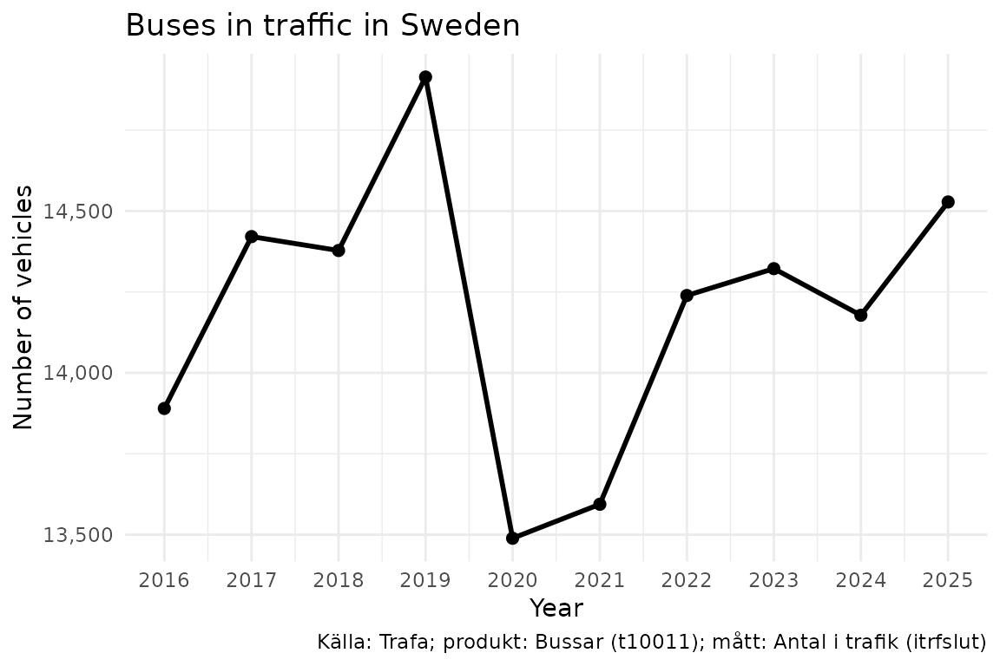
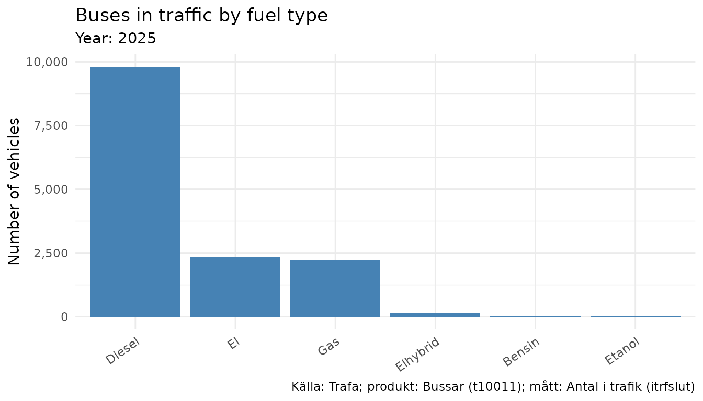
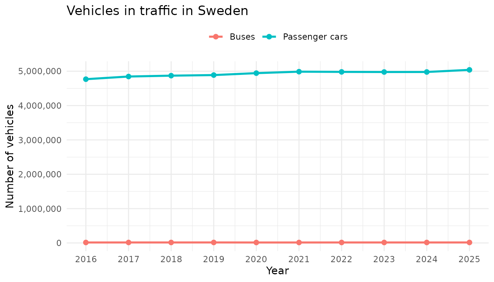

# Introduction to rTrafa

`rTrafa` is an R package for *discovering*, *inspecting* and
*downloading* Swedish transport statistics from the [Trafa
API](https://api.trafa.se/). This vignette provides an overview of the
methods included in the `rTrafa` package and the design principles of
the package API. To learn more about the specifics of functions and to
see a full list of the functions included, please see the [Reference
section of the package
homepage](https://lchansson.github.io/rTrafa/reference/index.html) or
run `??rTrafa`. For a quick introduction to the package see the vignette
[A quick start guide to
rTrafa](https://lchansson.github.io/rTrafa/articles/a-quickstart-rtrafa.md).

The design of `rTrafa` functions is inspired by the design and
functionality provided by several packages in the `tidyverse` family.
rTrafa uses the base R pipe (`|>`) throughout. Some vignette examples
use `dplyr` and `ggplot2` for data wrangling and visualisation:

``` r
install.packages("rTrafa")
```

``` r
library("rTrafa")
```

## Trafa’s data model

The Trafa API organises Swedish transport statistics in a four-level
hierarchy:

1.  **Product** — A statistical domain, e.g. *Buses* (t10011) or
    *Passenger cars* (t10016). Think of it as a family of related
    statistics.
2.  **Measure** — A specific KPI within a product. Buses has four
    measures: vehicles in traffic, deregistered, newly registered, and
    deregistrations.
3.  **Dimension** — A filterable variable such as year, fuel type, or
    owner category. Each dimension has discrete values you can select.
4.  **Value** — The individual codes within a dimension (e.g. `"2024"`,
    `"102"` for Diesel).

There is also a grouping concept called **Hierarchy**. A hierarchy like
“Owner” groups related dimensions (“Owner category” and “Licence type”)
together. Hierarchies are purely organisational — they cannot be used
directly in queries. Their child dimensions appear in
[`get_dimensions()`](https://lchansson.github.io/rTrafa/reference/get_dimensions.md)
with the hierarchy name noted in the `hierarchy` column.

rTrafa provides a function family for each of the first three levels:

| Level     | List                                                                                 | Search                                                                                   | Describe                                                                                     | Extract                                                                                                | Values                                                                                   |
|-----------|--------------------------------------------------------------------------------------|------------------------------------------------------------------------------------------|----------------------------------------------------------------------------------------------|--------------------------------------------------------------------------------------------------------|------------------------------------------------------------------------------------------|
| Product   | [`get_products()`](https://lchansson.github.io/rTrafa/reference/get_products.md)     | [`product_search()`](https://lchansson.github.io/rTrafa/reference/product_search.md)     | [`product_describe()`](https://lchansson.github.io/rTrafa/reference/product_describe.md)     | [`product_extract_ids()`](https://lchansson.github.io/rTrafa/reference/product_extract_ids.md)         | —                                                                                        |
| Measure   | [`get_measures()`](https://lchansson.github.io/rTrafa/reference/get_measures.md)     | [`measure_search()`](https://lchansson.github.io/rTrafa/reference/measure_search.md)     | [`measure_describe()`](https://lchansson.github.io/rTrafa/reference/measure_describe.md)     | [`measure_extract_names()`](https://lchansson.github.io/rTrafa/reference/measure_extract_names.md)     | —                                                                                        |
| Dimension | [`get_dimensions()`](https://lchansson.github.io/rTrafa/reference/get_dimensions.md) | [`dimension_search()`](https://lchansson.github.io/rTrafa/reference/dimension_search.md) | [`dimension_describe()`](https://lchansson.github.io/rTrafa/reference/dimension_describe.md) | [`dimension_extract_names()`](https://lchansson.github.io/rTrafa/reference/dimension_extract_names.md) | [`dimension_values()`](https://lchansson.github.io/rTrafa/reference/dimension_values.md) |

## Products

``` r
products <- get_products()
```

The product table has one row per statistical product:

``` r
dplyr::glimpse(products)
#> Rows: 56
#> Columns: 5
#> $ name        <chr> "t10011", "t10014", "t10015", "t10017", "t10018", "t10019"…
#> $ label       <chr> "Bussar", "Motorcyklar", "Mopeder klass I", "Släpvagnar", …
#> $ description <chr> "", "", "", "", "", "", "", "", "Bussar\n\nDefinitioner-> …
#> $ id          <int> 203, 206, 207, 209, 210, 211, 222, 227, 231, 232, 233, 234…
#> $ active_from <chr> "2019-01-10T10:17:00", "2019-01-10T10:25:00", "2019-01-10T…
```

All entity tables support the same set of operations.
[`product_search()`](https://lchansson.github.io/rTrafa/reference/product_search.md)
filters by regex:

``` r
products |>
  product_search("Personbilar") |>
  product_describe(max_n = 2)
#> ── t10094: Personbilar ────────────────────────────────────────────────────────── 
#>   Description: Personbilar
#> 
#> Definitioner->Enskild näringsidkare: En enskild näringsidkare är en person som själv driver och ansvarar för ett företag. Enligt bolagsverket är en enskild näringsidkare inte en juridisk person. I fordonsregistret redovisas alla bolagsformer under juridisk person.
#>   Active from: 2019-04-29T11:00:00 
#> 
#> ── t10026: Personbilar ────────────────────────────────────────────────────────── 
#>   Active from: 2020-05-08T12:59:00 
#> 
#> ... and 2 more product(s).
```

[`product_extract_ids()`](https://lchansson.github.io/rTrafa/reference/product_extract_ids.md)
extracts the `name` column as a character vector — useful for passing
into downstream functions:

``` r
products |>
  product_search("Personbilar") |>
  product_extract_ids()
#> [1] "t10094" "t10026" "t10036" "t10016"
```

## Measures

Each product contains one or more measures. A measure is the statistic
being observed — for example, *Antal i trafik* (vehicles in traffic) or
*Antal nyregistreringar* (new registrations).

``` r
measures <- get_measures("t10011")
```

``` r
measures |> measure_describe()
#> ── itrfslut (Antal i trafik) ──────────────────────────────────────────────────── 
#>   Product: t10011
#>   Description: Avser i slutet av perioden 
#> 
#> ── avstslut (Antal avställda) ─────────────────────────────────────────────────── 
#>   Product: t10011
#>   Description: Avser i slutet av perioden 
#> 
#> ── nyregunder (Antal nyregistreringar) ────────────────────────────────────────── 
#>   Product: t10011
#>   Description: Avser under perioden 
#> 
#> ── avregunder (Antal avregistreringar) ────────────────────────────────────────── 
#>   Product: t10011
#>   Description: Avser under perioden
```

Extract the names to use in
[`get_data()`](https://lchansson.github.io/rTrafa/reference/get_data.md):

``` r
measures |> measure_extract_names()
#> [1] "itrfslut"   "avstslut"   "nyregunder" "avregunder"
```

## Dimensions

Dimensions are the filter variables available for a product. Use
[`get_dimensions()`](https://lchansson.github.io/rTrafa/reference/get_dimensions.md)
to discover them:

``` r
dims <- get_dimensions("t10011")
```

``` r
dims |> dimension_describe()
#> ── ar (År) ────────────────────────────────────────────────────────────────────── 
#>   Data type: Time
#>   Selectable: Yes 
#>   Values (25): 2001 = 2001, 2002 = 2002, 2003 = 2003, 2004 = 2004, 2005 = 2005 ... and 20 more
#>   Filters: senaste = Senaste, forra = Föregående
#> 
#> ── avregform (Avregistreringsorsak) ───────────────────────────────────────────── 
#>   Selectable: Yes 
#>   Values (2): 20 = Utförda ur landet, t1 = Totalt
#> 
#> ── dimpo (Direkt import) ──────────────────────────────────────────────────────── 
#>   Selectable: Yes 
#>   Values (2): 10 = Direkt import, t1 = Totalt
#> 
#> ── leasing (Leasing) ──────────────────────────────────────────────────────────── 
#>   Selectable: Yes 
#>   Values (2): 30 = Leasade, t1 = Totalt
#> 
#> ── bussklass (Bussklass) ──────────────────────────────────────────────────────── 
#>   Description: Bussklasser enligt föreskrift nr 107 UNECE
#>   Selectable: Yes 
#>   Values (7): 1 = A, 2 = B, 3 = I, 4 = II, 5 = III ... and 2 more
#> 
#> ── drivm (Drivmedel) ──────────────────────────────────────────────────────────── 
#>   Selectable: Yes 
#>   Values (10): 101 = Bensin, 102 = Diesel, 103 = El, 104 = Elhybrid, 105 = Laddhybrid ... and 5 more
#> 
#> ── pass (Antal passagerare) ───────────────────────────────────────────────────── 
#>   Selectable: Yes 
#>   Values (12): 101 = – 20, 102 = 21 – 40, 103 = 41 – 50, 104 = 51 – 60, 105 = 61 – 70 ... and 7 more
#> 
#> ── agarkat (Ägarkategori)  [agare] ────────────────────────────────────────────── 
#>   Selectable: Yes 
#>   Values (3): 10 = Fysisk person, 20 = Juridisk person, t1 = Totalt
#> 
#> ── tillst (Tillstånd)  [agare] ────────────────────────────────────────────────── 
#>   Selectable: Yes 
#>   Values (3): 1 = Yrkesmässig trafik, 2 = Firmabilstrafik, t1 = Totalt
```

### Hierarchies

Some dimensions are grouped under a hierarchy. In the output above,
dimensions marked with `[agare]` belong to the “Owner” hierarchy. This
is metadata that helps you understand the logical structure — but when
building a query, you use the child dimension names directly
(e.g. `agarkat`, not `agare`).

``` r
dims |>
  dplyr::filter(!is.na(hierarchy))
#> # A tibble: 2 × 9
#>   product name    label data_type option description hierarchy n_values values  
#>   <chr>   <chr>   <chr> <chr>     <lgl>  <chr>       <chr>        <int> <list>  
#> 1 t10011  agarkat Ägar… String    TRUE   ""          agare            3 <tibble>
#> 2 t10011  tillst  Till… String    TRUE   ""          agare            3 <tibble>
```

### Dimension values and filter shortcuts

Each dimension has a set of valid values.
[`dimension_values()`](https://lchansson.github.io/rTrafa/reference/dimension_values.md)
returns them as a tibble:

``` r
ar_vals <- dimension_values(dims, "ar")
```

``` r
ar_vals
#> # A tibble: 27 × 3
#>    name    label      type  
#>    <chr>   <chr>      <chr> 
#>  1 senaste Senaste    filter
#>  2 forra   Föregående filter
#>  3 2001    2001       value 
#>  4 2002    2002       value 
#>  5 2003    2003       value 
#>  6 2004    2004       value 
#>  7 2005    2005       value 
#>  8 2006    2006       value 
#>  9 2007    2007       value 
#> 10 2008    2008       value 
#> # ℹ 17 more rows
```

Note the `type` column. Entries with `type = "filter"` are **filter
shortcuts** — dynamic values that the API resolves at query time:

- `senaste` — the most recent available value
- `forra` — the previous value

These are useful for building queries that stay current without
hardcoding years:

``` r
# Always gets the latest year, regardless of when you run it
get_data("t10011", "itrfslut", ar = "senaste")
```

Regular dimension values (`type = "value"`) can be inspected too:

``` r
drivm_vals <- dimension_values(dims, "drivm")
```

``` r
drivm_vals
#> # A tibble: 10 × 3
#>    name  label      type 
#>    <chr> <chr>      <chr>
#>  1 101   Bensin     value
#>  2 102   Diesel     value
#>  3 103   El         value
#>  4 104   Elhybrid   value
#>  5 105   Laddhybrid value
#>  6 106   Etanol     value
#>  7 107   Gas        value
#>  8 108   Biodiesel  value
#>  9 109   Övriga     value
#> 10 t1    Totalt     value
```

### Dimension validation

When you know which measure you want,
[`get_dimensions()`](https://lchansson.github.io/rTrafa/reference/get_dimensions.md)
can validate which dimensions are compatible:

``` r
# Only dimensions valid for the "itrfslut" measure
get_dimensions("t10011", measure = "itrfslut")

# See all dimensions with their validity status
get_dimensions("t10011", measure = "itrfslut", only_valid = FALSE)
```

You can also pass **several measures at once**. The API returns the
intersection — only dimensions that are valid for *every* measure in the
vector. This is useful when you want to compare or combine measures and
need to know which filters you can apply uniformly:

``` r
# Dimensions valid for BOTH "vehicles in traffic" and "new registrations"
get_dimensions("t10011", measure = c("itrfslut", "nyregunder"))
```

For Buses, only `ar` (year) survives this intersection — most other
dimensions are specific to one measure or the other.

## Fetching data

[`get_data()`](https://lchansson.github.io/rTrafa/reference/get_data.md)
is the core function. Provide a product, a measure, and optional
dimension filters:

``` r
bus_data <- get_data("t10011", "itrfslut",
  ar = as.character(2016:2025)
)
```

``` r
dplyr::glimpse(bus_data)
#> Rows: 10
#> Columns: 3
#> $ ar       <chr> "2016", "2017", "2018", "2019", "2020", "2021", "2022", "2023…
#> $ ar_label <chr> "2016", "2017", "2018", "2019", "2020", "2021", "2022", "2023…
#> $ itrfslut <dbl> 13890, 14421, 14378, 14914, 13489, 13594, 14239, 14322, 14178…
```

When `simplify = TRUE` (the default), each dimension gets both a code
column and a `_label` column with the human-readable name.

### Prepared queries

For complex queries,
[`prepare_query()`](https://lchansson.github.io/rTrafa/reference/prepare_query.md)
validates your selections before hitting the data endpoint:

``` r
q <- prepare_query("t10011", "itrfslut",
  ar = c("2023", "2024"),
  drivm = c("101", "102", "103")
)
q
#> Trafa query: t10011 | itrfslut
#>   Dimension filters:
#>     ar = c("2023", "2024")
#>     drivm = c("101", "102", "103")
#>   Available (unfiltered) dimensions: ...

# Pass the validated query to get_data()
get_data(query = q)
```

### Data helpers

[`data_minimize()`](https://lchansson.github.io/rTrafa/reference/data_minimize.md)
removes columns where all values are identical — useful after filtering
to a single year or fuel type:

``` r
get_data("t10011", "itrfslut", ar = "2024") |>
  data_minimize()
```

[`data_legend()`](https://lchansson.github.io/rTrafa/reference/data_legend.md)
generates a source caption for plots:

``` r
data_legend(bus_data)
#> [1] "Källa: Trafa; produkt: Bussar (t10011); mått: Antal i trafik (itrfslut)"
```

## Example: buses in traffic over time

Note how we convert the `ar` column to a proper `Date` before plotting.
Trafa returns `ar` as a character column (`"2016"`, `"2017"`, …), and
plotting it as an integer can produce awkward `ggplot2` breaks like
`2020, 2022.5, 2025`. Wrapping it in `as.Date(paste0(ar, "-01-01"))`
lets
[`scale_x_date()`](https://ggplot2.tidyverse.org/reference/scale_date.html)
place tick marks on whole years. This is a pattern you’ll want to reuse
for any time-series analysis — both in `rTrafa` and in the sibling
packages `rKolada` and `pixieweb`.

``` r
library("ggplot2")

bus_plot <- bus_data |>
  dplyr::mutate(year = as.Date(paste0(ar, "-01-01")))

ggplot(bus_plot, aes(x = year, y = itrfslut)) +
  geom_line(linewidth = 1) +
  geom_point(size = 2) +
  # Years as dates, one tick per year
  scale_x_date(date_breaks = "1 year", date_labels = "%Y") +
  scale_y_continuous(labels = scales::comma) +
  labs(
    title = "Buses in traffic in Sweden",
    x = "Year",
    y = "Number of vehicles",
    caption = data_legend(bus_data)
  ) +
  theme_minimal()
```



## Example: fuel type breakdown

``` r
drivm_data <- get_data("t10011", "itrfslut",
  ar = "senaste",
  drivm = c("101", "102", "103", "104", "105", "106", "107")
)
```

``` r
ggplot(drivm_data, aes(
  x = reorder(drivm_label, -itrfslut),
  y = itrfslut
)) +
  geom_col(fill = "steelblue") +
  scale_y_continuous(labels = scales::comma) +
  labs(
    title = "Buses in traffic by fuel type",
    subtitle = paste("Year:", drivm_data$ar_label[1]),
    x = NULL,
    y = "Number of vehicles",
    caption = data_legend(drivm_data)
  ) +
  theme_minimal() +
  theme(axis.text.x = element_text(angle = 35, hjust = 1))
```



## Example: comparing vehicle types

By fetching the same measure from different products we can compare
across vehicle types:

``` r
pbilar_data <- get_data("t10016", "itrfslut",
  ar = as.character(2016:2025)
)
```

``` r
comparison <- dplyr::bind_rows(
  bus_data |> dplyr::mutate(vehicle = "Buses"),
  pbilar_data |> dplyr::mutate(vehicle = "Passenger cars")
) |>
  dplyr::mutate(year = as.Date(paste0(ar, "-01-01")))

ggplot(comparison, aes(x = year, y = itrfslut, color = vehicle)) +
  geom_line(linewidth = 1) +
  geom_point(size = 2) +
  scale_x_date(date_breaks = "1 year", date_labels = "%Y") +
  scale_y_continuous(labels = scales::comma) +
  labs(
    title = "Vehicles in traffic in Sweden",
    x = "Year",
    y = "Number of vehicles",
    color = NULL
  ) +
  theme_minimal() +
  theme(legend.position = "top")
```



## Related packages

`rTrafa` is part of a family of R packages for Swedish and Nordic open
statistics that share the same design philosophy — tibble-based,
pipe-friendly, and offline-safe:

- [rKolada](https://lchansson.github.io/rKolada/) — R client for the
  [Kolada](https://kolada.se/) database of Swedish municipal and
  regional Key Performance Indicators
- [pixieweb](https://lchansson.github.io/pixieweb/) — R client for
  PX-Web APIs (Statistics Sweden, Statistics Norway, Statistics Finland,
  and more)
